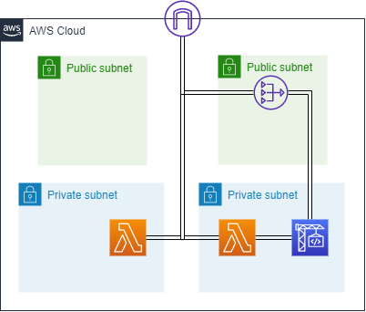

# backlog-git2s3

## ■目的■
BacklogのGitリポジトリにプッシュしたソースコードを、AWSアカウントのS3に打ち上げるシステムを作成します。

すでにAWSLambda（Python2.7）で構築済みのシステムがあるのですが、

1. Python2.7が完全にEOLになりそう
2. Lambdaの拡張性が限定的でソースの拡張に耐えきれくなくなってきた、

という問題があるので、システムを一新します。

[Backlog](https://backlog.com/ja/)：チケット型のタスク管理ツール。Github・Subversionとチケットの連携がよい。弊社で利用中。

[AWSLambda](https://aws.amazon.com/jp/lambda/)：AWS のサーバレス実行環境。イチオシ。Lambdaをすこれ。

[CodeBuild](https://aws.amazon.com/jp/codebuild/)：AWSのビルドサービス。
[CodeCommit](https://aws.amazon.com/jp/codecommit/)、[CodeDeploy](https://aws.amazon.com/jp/codedeploy/)と組み合わせたCI/CD環境が一般的な利用法。今回は違う。

## ■システムデザイン

下記、AWS公式のシステムを拡張し、構築します。

[Git WebhookとAWSのサービス](https://aws.amazon.com/jp/quickstart/architecture/git-to-s3-using-webhooks/)

Third-party Git repositoryにBacklogのGitリポジトリが入ります。

BacklogのGitはSSH鍵を利用した通信を許可しているので、

1. AWS公式のシステムを展開。
2. 生成されたSSH鍵をBacklogに登録

で、Git2S3が完成する。

## ■本題
### 1. ネットワークを作成する。
「1.AWS公式のシステム」のLambdaとCodeBuildが配置されるVPCを作ってあげます。

Backlog側で接続元IPアドレス制限をかけているため、Natgatewayを利用しLambdaのＩＰアドレスを固定しています。
(Natgatewayを利用しない場合、Lambdaが起動するたびにIPアドレスが変更されるので、悲惨なことに。。。)

Backlog側でIPアドレス制限を設けない場合は、LambdaのVPC設定なし、CodeBuildようにパブリックサブネットだけ用意、でいいと思います。サーバレスなので。

